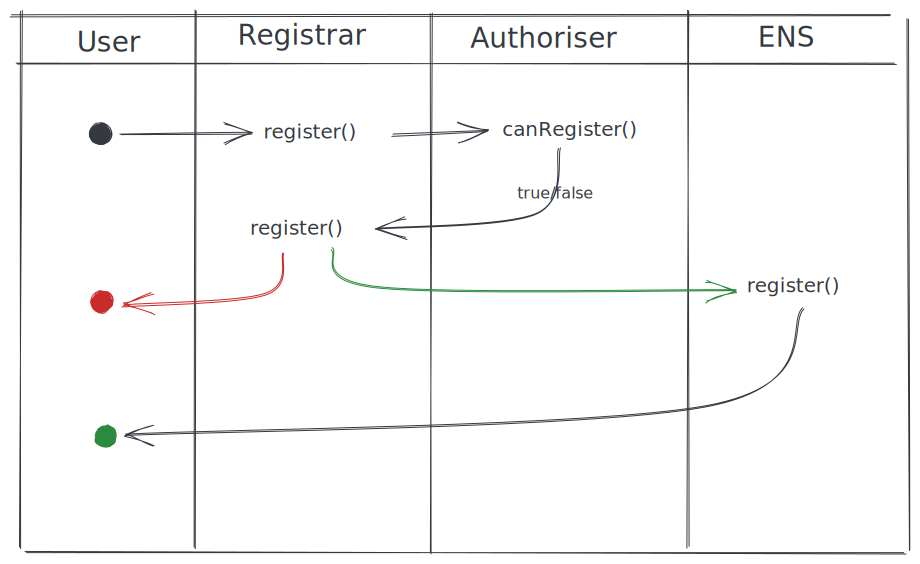

# me3 Protocol

[](https://docs.mythx.io/dashboard/github-badges)

Glossary:

* **Project**: an NFT project, we track their ENS node in our smart contracts (eg: pcc.eth)
* **Subdomain**: an ENS subnode attached to an associated Project node (eg: someone.pcc.eth)
* **Authoriser**: a contract that defines the authorisation rules for a project

## Deployments

* Registrar: `0x9fef5b1868de0c511121a3c354c28e2b741eb101` on:
  * Rinkeby
  * Goerli
* Example NftAuthoriser using `WorstNftEver` as the backend:
  * Rinkeby: `0xb4657a293edd026d7bbe343cd47d00f62ef0e311`
  * Goerli: `0xd370ac13f4b084a40b0d65338a8ba52ef5921955`

## Project Controls

NFT projects have the following set of controls for subdomain registration:

* [authorise](#authorisation) which addresses can register a subdomain
* validate that a subdomain can be registered
* decide who the subdomain owner is (the project or the registrant)

## Authorisation

There are two avenues of authorisation that a contract user can follow: registration and editing.

Any project is able to create their own authorisation contract using the `IAuthoriser` interface:

```solidity
interface IAuthoriser {
    function canRegister(
        bytes32 node,
        address sender,
        bytes memory blob
    ) external view returns (bool);
    
    function canEdit(
        bytes32 node,
        address sender,
        bytes memory blob
    ) external view returns (bool);
}
```

### Parameters

The authorisation functions take the same inputs but are split for more fine-grained
authorisation logic.

| Param                   | Description                                                                           | Notes                                                                                               |
| ---                     | ---                                                                                   | ---                                                                                                 |
| `bytes32 node`          | The fully qualified ENS name, namehashed                                              | In Javascript, the value of this call: `ethers.utils.namehash('someone.somewhere.eth')`             |
| `address sender`        | The `msg.sender` for `Registrar.register`                                             |                                                                                                     |
| `bytes memory authData` | Additional data for authorisation, defined by the contract implementing `IAuthoriser` | Developer should perform a lot of saftey checks so that users do not pass arbitrary data for access |

### Example authorisation contract via `NftAuthoriser`

We provide a simple authorisation contract for NFT projects. The contract checks
for two things:

* Was the `tokenId` passed in the `authData`? This requires the `tokenId` to be non-zero
* Is the token currently owned by the `sender`?

If either condition fails, then authorisation fails.



## Development

### Testing

```sh
make test
```

### Static Analysis

All `slither` calls should be made from repo root.

**Generating callgraphs:**

```sh
rm docs/callgraphs/*.dot
slither . --filter-paths "test|lib" --print call-graph
mv *.dot docs/callgraphs/
```

**Generating checklist:**

```sh
slither . --filter-paths "test|lib" --checklist > old-docs/slither-checklist.md
```
