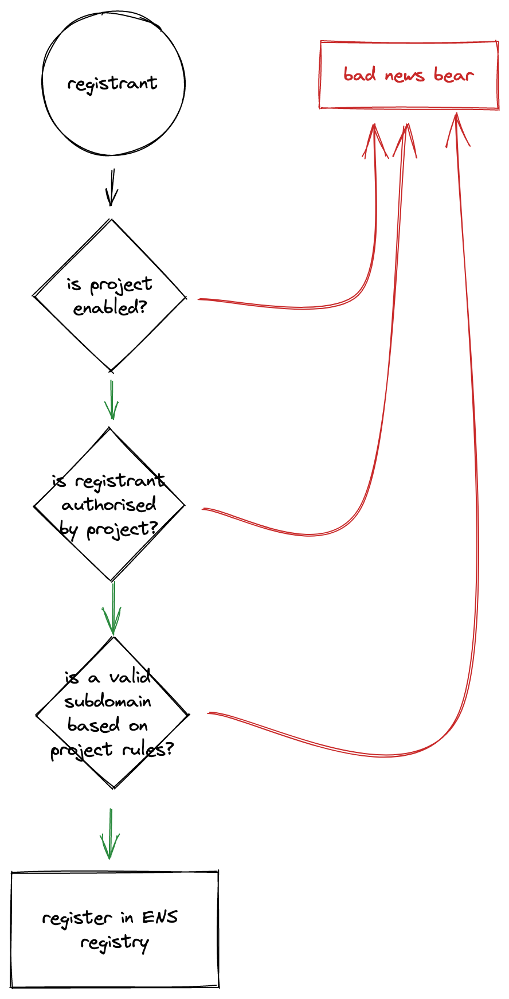

# me3 Protocol

Glossary:

* **Project**: an NFT project, we track their ENS node in our smart contracts

## Project Controls

NFT projects have the following set of controls for subdomain registration:

* authorise which addresses can register a subdomain
* validate that a subdomain can be registered
* decide who the subdomain owner is (the project or the registrant)

## Functions

### Register

The register reverts in the following cases:
* if a project has not yet been enabled
* if the project determines the registrant is not authorised
* if the subdomain is valid, according to the project

